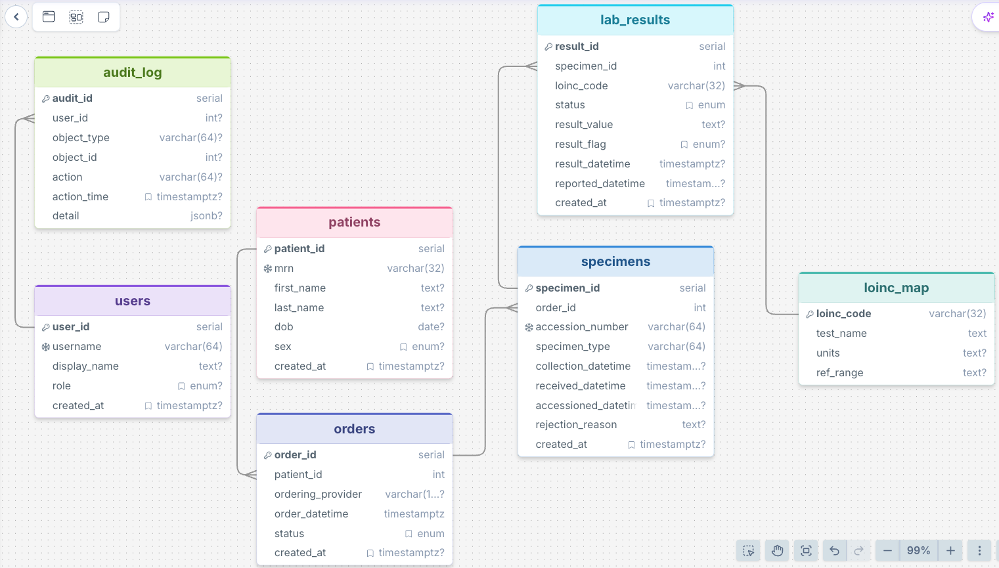

# Akai Community Hospital EHR & Informatics System
Clinical Informatics and Healthcare Systems portfolio demonstrating clinical workflows, HL7 interoperability, SQL database design, healthcare analytics, and EHR architecture through the Akai Community Hospital project. Each phase is connected to the classes I take in my Informatics program.


## 🎯 Overarching Project Mission

Akai Community Hospital EHR & Informatics System is an end-to-end Laboratory Information System (LIS) and EHR application architecture portfolio designed to answer two critical questions:
1. **Operational:** *How can a healthcare organization capture, secure, model, and analyze clinical data to improve patient care and executive decision-making?*
2. **Technical:** *How should healthcare data be collected, stored, secured, organized, and reported so the right people get the right information at the right time?*

---

## 🚀 Live Portfolio Deployment

An interactive, containerized version of this Laboratory Information System (LIS) application is deployed and hosted on **Streamlit Community Cloud**. 

👉 **[Click Here to Launch the Live Interactive Dashboard](https://akaicommunityhospitalehrinformaticssystem-22hfgpri9pxankh9uqmj.streamlit.app/)**

### 🎮 What You Can Do in the Live Cloud Demo:
* **Interactive Registry:** Filter the active clinical worklist by Patient Last Name or Accession Number using parameterized SQL filters.
* **HIPAA Compliance Audit Trail:** Navigate to the `audit_log` workspace to view immutable compliance logging rows generated in real-time by native database schema triggers.
* **SQL Query Console Sandbox:** Execute raw, read-only SQL queries (`SELECT`, `JOIN`, `GROUP BY`) directly against the live database framework with built-in injection guardrails.


## 🏗️ Entity Relationship Diagram (V2)



## 🗺️ Curriculum Mapping & Architecture Deliverables

### Phase 1: HL7 Interface Engineering & Logic Validation (INFM 109 & SDEV 120)
* **Core Question:** *How are external laboratory instrument interfaces validated, and how is raw clinical data ingested securely into the EHR?*
* **What I'm Building:** End-to-end interface validation workflows simulating an EHR inbound engine. This includes parsing and validating inbound HL7 `ORM^O01` (Laboratory Order) and `ORU^R01` (Observation Result) messages. It focuses on validating Patient Identification `PID`, Common Order `ORC`, and Observation Request `OBR` segments to eliminate interface parsing faults before they hit clinical environments.

### Phase 2: Clinical Data Dictionary & Relational Architecture (DBMS 110 & DBMS 130)
* **Core Question:** *How are complex laboratory master files, specimen records, and clinical dictionaries structured to ensure data integrity?*
* **What I'm Building:** Normalized PostgreSQL database schema managing `Patients`, `Specimens`, `Orders`, and `LOINC_Map` `Lab_Results`, and audit logging for clinical data integrity.

#### 🏥 Infrastructure & Cost Optimization Strategy (Broadcom/VMware Alignment)

* **Context:** Following Broadcom’s acquisition of VMware, enterprise software licensing shifted from a flat **per-socket** model to a strict **per-core subscription** model. For a mid-sized healthcare system like Akai Community Hospital, this infrastructure change represents a projected **300% spike** in baseline operating costs for virtualized backend server environments.
* **Project Impact:** Because the Akai Laboratory Information System (LIS) database processes high-volume transactional data, inefficient queries directly translate to high CPU core utilization, driving up licensing expenses. To combat this, this schema is engineered with defensive database optimization strategies.
* **Strategic Indexing:** Tables like `lab_results` utilize localized index layers (`idx_results_flag`, `idx_results_loinc_code`) to drastically compress query search times.
* **Compute Footprint Reduction:** By ensuring high-speed data retrieval at the database level, the system minimizes the processing burden on the underlying virtual machines. 
* **Business Outcome:** This design allows the hospital to safely scale down its required cluster core allocation, protecting the IT budget from licensing inflation while preserving 99.99% database availability for critical clinical workflows.

### Phase 3: Security, Audit & Compliance (HIMT 104 & CSIA 105)
* **Core Question:** *How is patient data secured and audited for HIPAA compliance?*
* **What I'm Building:** Role-Based Access Control (RBAC) concepts and `audit_log` architecture designed to support HIPAA-aligned monitoring of Protected Health Information (PHI).

#### 🛡️ Platform Migration Security & Data Sovereignty

* **Context:** Migrating core clinical systems away from legacy virtualization providers to alternative platforms requires strict data sovereignty safeguards. Moving live patient data between server clusters introduces severe vectors for unauthorized data exposure and operational disruptions.
* **Project Impact:** To protect patient data during infrastructure transformations, the Akai LIS incorporates defensive auditing mechanisms directly within the transaction pipeline.
* **Granular Audit Logging:** The `audit_log` table captures precise user context, specific action states (`create`, `read`, `update`, `delete`), and structural mutations utilizing structural JSONB data objects.
* **Data Integrity Enforcement:** Relational foreign keys and schema-level validation constraints guarantee that patient records, specimens, and laboratory results maintain strict data alignment, preventing data corruption during unexpected server failovers.
* **Business Outcome:** This strategy enforces continuous compliance with HIPAA Security Rules during architectural data transfers, ensuring that patient tracking and privacy baselines remain uninterrupted during critical IT operational changes

### Phase 4: Clinical Systems Reporting & Performance Analytics (INFM 219 & CPIN 269)
* **Core Question:** *How does data drive operational efficiency and patient outcomes?*
* **What I'm Building:** Power BI executive dashboards tracking laboratory turnaround times (TAT), specimen rejection rates, and critical flag alerts.

## 🚀 How to Run and Setup the LIS Database Locally

Follow these steps to clone this repository, construct the relational schema, and seed the database with synthetic clinical records.

### 1. Prerequisites
Ensure you have the following installed on your local machine:
* **Python 3.10+**
* **Git**
* **Database Engine:** PostgreSQL (with pgAdmin 4) OR Microsoft SQL Server (with Azure Data Studio / SSMS)

### 2. Clone the Repository
Open your terminal and run the following commands to pull the master files:
```bash
git clone https://github.com
cd Akai_Community_Hospital_EHR_Informatics_System
```

### 3. Install Dependencies
Install the required database drivers and the data generation library (`Faker`) using pip:
```bash
# For PostgreSQL environments (Mac/Linux/Windows local setups)
pip install psycopg2-binary faker

# For Microsoft SQL Server environments (School/Windows setups)
pip install pyodbc mssql faker
```

### 4. Build the Database Schema
Create a blank database named `akai_lis`, open your database tool's Query Window, and execute the corresponding architectural script:

* **If using PostgreSQL:** Execute the table definitions found in `database/schema.sql`.
* **If using Microsoft SQL Server:** Execute the table definitions found in `database/schema_sql_server.sql`.

### 5. Seed Synthetic Clinical Data
Run the correct automated Python engine that matches your database platform to populate empty tables with realistic patient demographics, lab orders, and results:

```bash
# For PostgreSQL (Native Mac setup)
python3 scripts/seed_database.py --patients 50 --max-orders 3

# For Microsoft SQL Server (School/Windows setup)
python3 scripts/seed_database_sql_server.py --patients 50 --max-orders 3
```
*Note: To wipe existing data and start a fresh simulation run, append the `--reset` flag to the command.*

### 6. Verify Analytical Outputs
Once seeded, open and run the pre-built reporting queries saved inside the `sql/` workspace directory to review clinical KPIs, processing turnaround times, and audit trails.

